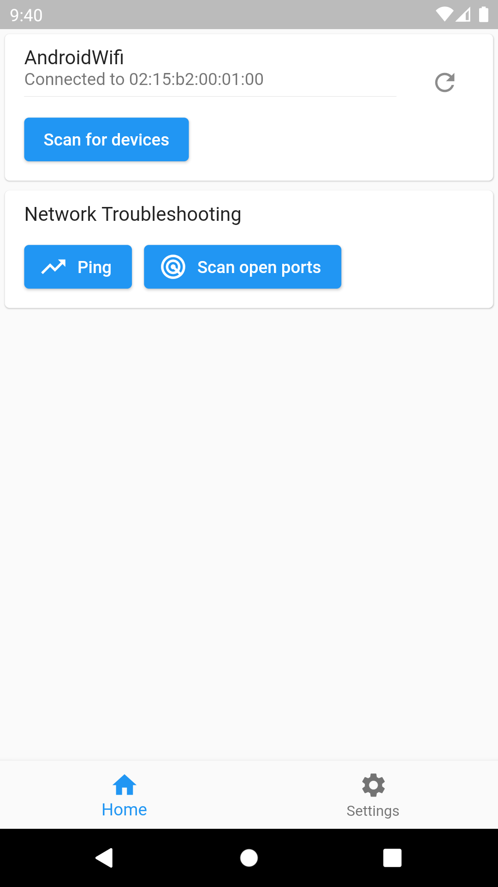
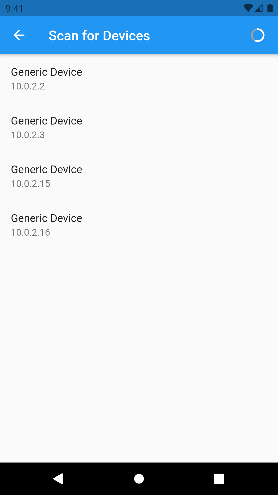
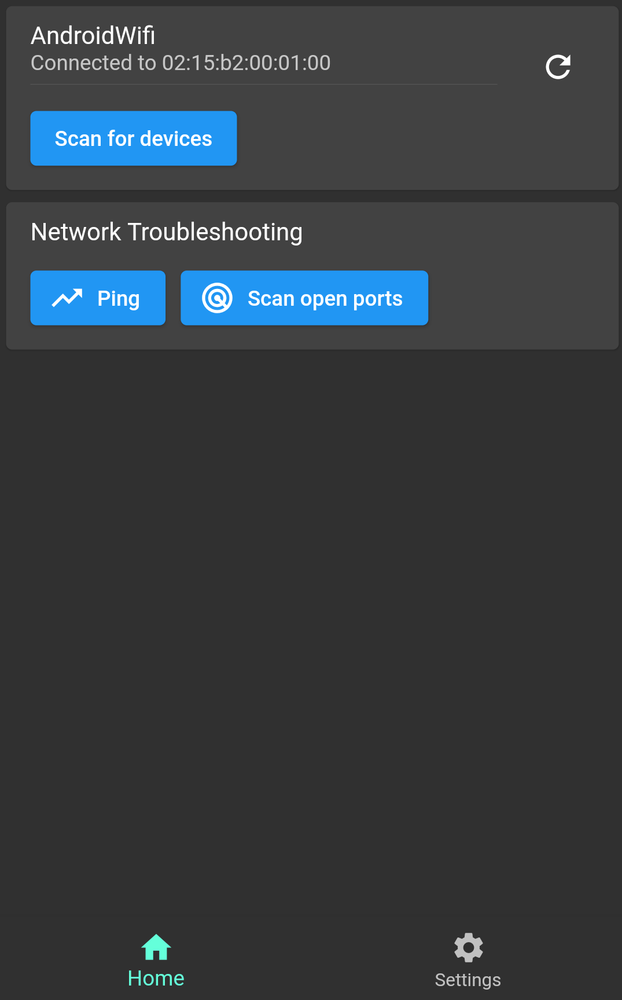

# Vernet

Vernet - Network Analyzer and Monitoring Tool

## Features

1. Shows Wi-Fi details such as BSSID and MAC Address.
2. Scans for devices(or hosts) on network
3. Scans for open ports of target IP
4. Shows ISP details

## Screenshots

|Vernet|Home|Devices|Open Ports|Dark Home|Settings|
|-|-|-|-|-|-|
|||||||

## Download

|   Android | iOS | macOS | Linux | Windows |
|-----------|-----|-------|-------|---------|
|| Works on emulator |<a href='https://github.com/git-elliot/vernet/releases/latest'>|<a href='https://github.com/git-elliot/vernet/releases/latest'>| <a href='https://github.com/git-elliot/vernet/releases/latest'>|

## How to install

### Instructions for macOS

Note: macOS build hasn't been notarized yet.

1. Star this repository.
2. Download vernet-macos.zip from [releases](https://github.com/git-elliot/vernet/releases/latest)
3. Extract downloaded zip file.
4. Copy app file to the Applications folder.
5. Go to Applications folder.
6. Press down cmd + left click on vernet.
7. In context menu, click on open.

### Instructions for Linux

1. Star this repository.
2. Install `net-tools` package for `arp` command, otherwise app will not run.
3. Download vernet-linux.zip from [releases](https://github.com/git-elliot/vernet/releases/latest)
4. Extract downloaded zip file.
5. Go to bundle folder and double click vernet file.

## Contributors Required

1. Linux/Windows Tester
2. Documenter

Drop mail at fs0c19ty@protonmail.com

## How to Contribute

1. Found bug? Open an [issue](https://github.com/git-elliot/vernet/issues)
2. Do you know Flutter? Fix bugs and open a [Pull Request](https://github.com/git-elliot/vernet/pulls)

## Support and Donate

1. Support this project by becoming stargazer of this project.
2. Buy me a coffee.

    | Librepay | 
    |----------|
    |

3. Support me on Ko-Fi

    
