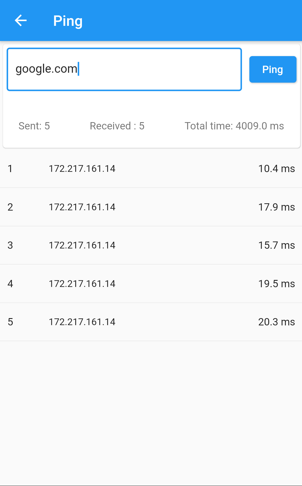

# Vernet

Vernet - Network Analyzer and Monitoring Tool

## Features

1. Shows Wi-Fi details
2. Scans for devices(or hosts) on network
3. Scans for open ports of target IP
4. Shows ISP details

## Screenshots

|||||
|-|-|-|-|
|||||
|||||

## Download

|   Android || iOS | macOS | Linux | Windows |
|-----------|------------|-----|-------|-------|---------|
||| Build Ready |<a href='https://github.com/git-elliot/vernet/releases/latest'>| Need contributor | Need contributor |

## How to install

### Instructions for macOS

macOS build is not notarized as of now.

1. Copy app file to the Applications folder
2. Go to Applications folder.
3. Press down cmd + left click.
4. In context menu, click on open.

## Contributors Required

1. Linux Packager & Tester
2. Windows Packager & Tester
3. Documenter

Drop mail at fs0c19ty@protonmail.com

## How to Contribute

1. Found bug? Create an [issue](https://github.com/git-elliot/vernet/issues)
2. Do you know Flutter? Fix bugs and open a [Pull Request](https://github.com/git-elliot/vernet/pulls)

## Donate

Support this project. Buy me a coffee.

|   Bitcoin |   UPI |
|-----------|-------|
|||
